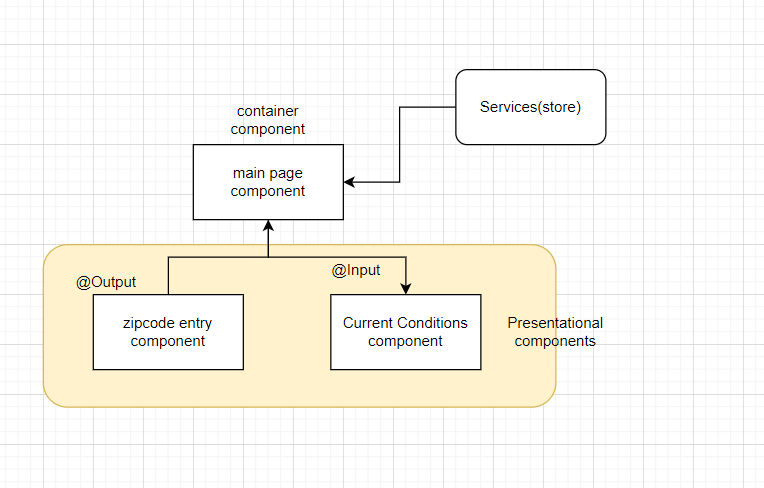

# ngrx-weather
An example of how to use Ngrx on a simple Angular app
In order to generate state:
```
ng generate @ngrx/schematics:store State --root --module app.module.ts
```
```
ng generate @ngrx/schematics:reducer ZipCodes --group
```

Generate action:
```
ng generate @ngrx/schematics:action CurrentCondition --group
```
**Ngrx store, reducers, actions**
In order to navigate the source code you can refer:
1. index.ts under reducers.
2. zip-codes.reducer.ts: where you define the accordingly actions and states.
3. under actions folder: refer zipcode.actions.ts: They are more enum to differentiate the type of actions.
4. See how it reflects local variables subscribe changes: current-conditions.component.ts.
5. See how it dispatch the action to reducer: zipcode-entry.component.ts

**Ngrx effects: asynchronous tasks**
Effects are a way to handle asynchronous tasks.
Action dispatched --> effect triggered --> new action dispatched once async task completes.

Install:
```
npm install @ngrx/effects --save
```
Generate the effect:
```
ng generate @ngrx/schematics:effect CurrentConditions --module app.module --group
```
Refer the below files:
1. Current-conditions.effects.ts: where we listen to action add zipcode, fetch data from the server and update.
2. Current-condition.component.ts where we call this effects get current 
3. Inside current-conditions.reducer.ts: where we call the enum.

**The NgRx router store**
Install:
```
npm install @ngrx/router-store --save
```
Refer the below files:
1. index.ts: decare router under reducer and state.
2. Under app.module.ts: declare router:
StoreRouterConnectingModule.forRoot({stateKey: 'router'})
This is for us to use effect on our state router.

**NgRx Router Store Actions:**
1. ROUTER_NAVIGATION when navigation is initiated.
2. ROUTER_CANCEL when guard cancels navigation.
3. ROUTER_ERROR: example routes don't exist.

**Entities to manage record collections**
```
ng generate @ngrx/schematics:entity User --group
```
See the below files:
1. user.action.ts
2. user.reducer.ts
3. user.model.ts (add properties)

**Component Architecture in Angular**
Angular embraces reactive programming, where components know how to react to external changes. There are 2 types of components:
Container components know how to get data and work with services.
Presentational components: have to be fed with data.


Only Container Component will aware store service.

Check the below files:
1. zipcode-entry.component.ts and zipcode-entry.component.html
2. main-page.component.ts (see how handle all logic)
